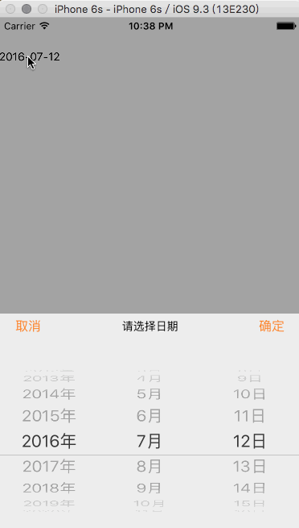

# react-native-modal-date-picker
react native date picker 

###简介
 
 这是一个react-native的时间选择器，使用了iOS原生的modal和picker组件。
 支持ios和android。
 

### API
selectData: 选择的值，通过onSelect回调修改，格式为“YYYY-MM-DD”。

onSelect： 回调函数，参数为修改后的data值。

formater： 显示的格式，默认为“YYYY-MM-DD”，可参考[moment](http://momentjs.com/)修改。

cancleText： 取消的文本，默认为“取消”。

finishText： 确定的文本，默认为“确定”。

title： 组件标题，默认为“请选择日期”。

modalColor： modal层的颜色，默认为“rgba(0,0,0,0.4)”。

pickerColor： 组件的颜色，默认为“rgba(255,255,255,0.8)”。

buttonColor： 确定和取消按钮的颜色，默认为“#FE751D”。

pickerHeight： 组件的高度，默认为400。

keepShowModal： 点击组件外的modal层是否不关闭组件，默认关闭组件。值为true或false。

### 安装
    npm install react-native-modal-date-picker ——save
    
###使用
	import React, { Component } from 'react';
	import {
	  AppRegistry,
	  StyleSheet,
	  Text,
	  View
	} from 'react-native';
	
	import Picker from 'react-native-modal-date-picker'
	import moment from 'moment'
	
	class AwesomeProject extends Component {
	  constructor(props) {
	    super(props);
	    this.state = {
	      value: moment(new Date).format('YYYY-MM-DD')
	    };
	  }
	  onSelect (value) {
	    this.setState({value:value})   
	  }
	
	  render() {
	    return (
	      <View style={{marginTop:40}}>
	        <Picker selectData={this.state.value} onSelect={this.onSelect.bind(this)} formater="YYYY-MM-DD hh:mm:ss" cancleText="cancle" finishText="finish" title="title" modalColor="#000" keepShowModal={true} pickerHeight={400} pickerColor="#fff" buttonColor="#000"/>
	      </View>
	    );
	  }
	}
	
	const styles = StyleSheet.create({
	  
	});
	
	AppRegistry.registerComponent('AwesomeProject', () => AwesomeProject);

###协议
MIT
